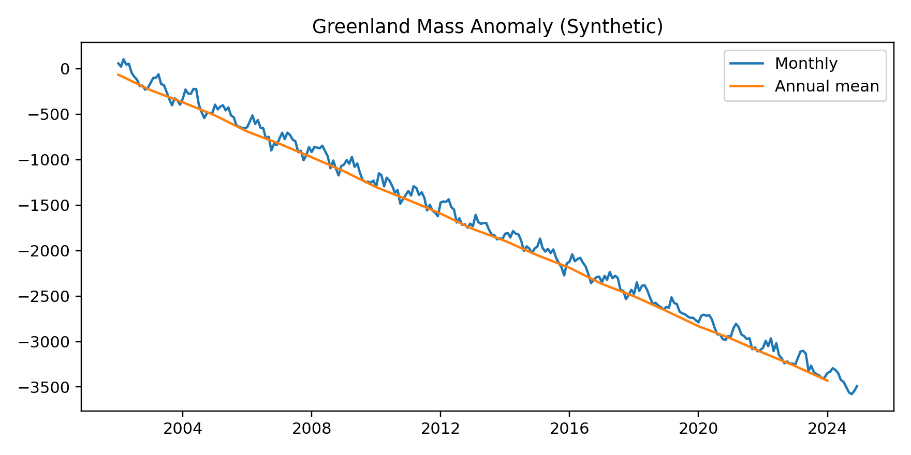
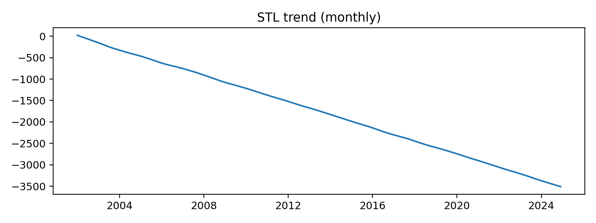
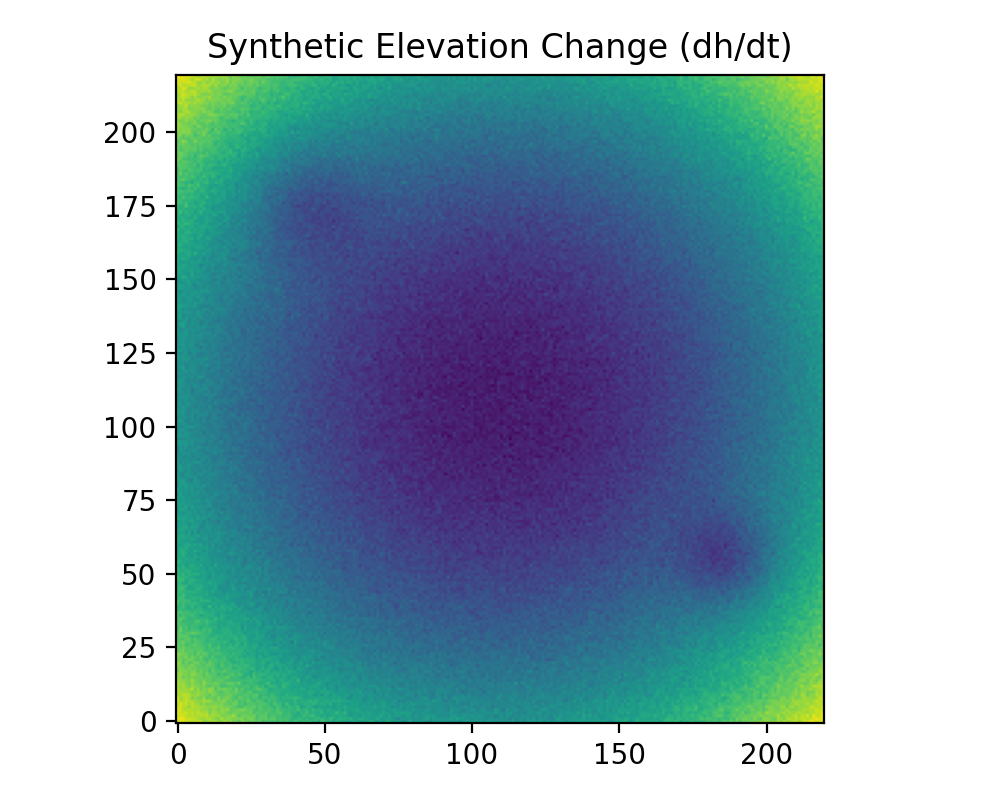
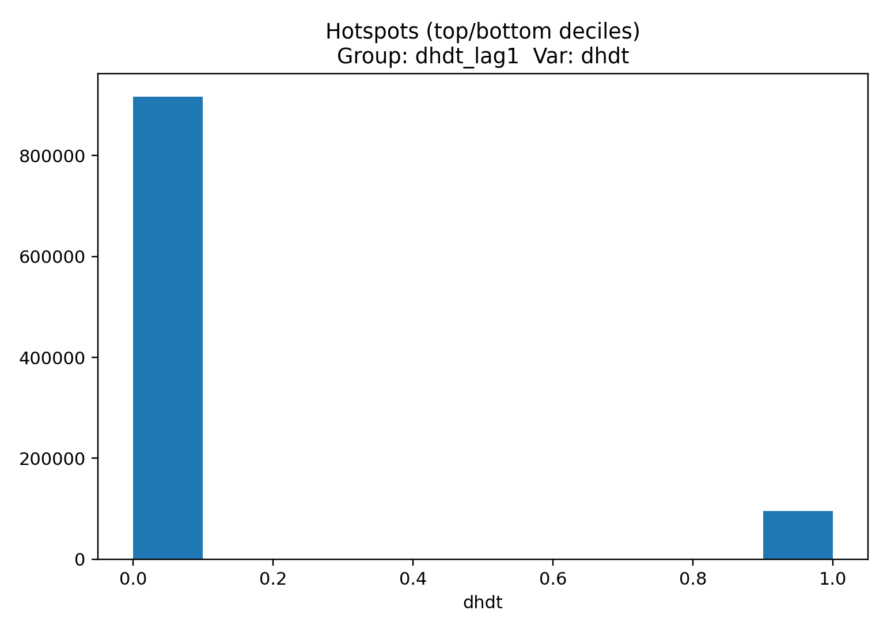

# Greenland Ice Sheet – GIS & Time‑Series Demo
Turning satellite data into maps & insights: Greenland mass balance (time-series, 95% CI) and elevation-change hotspots (ICESat-2 ATL15 10 km).







Quickstart:

```bash
python -m venv .venv
source .venv/bin/activate    # Windows: .venv\Scripts\activate
pip install -r requirements.txt
python src/pipeline.py
```
