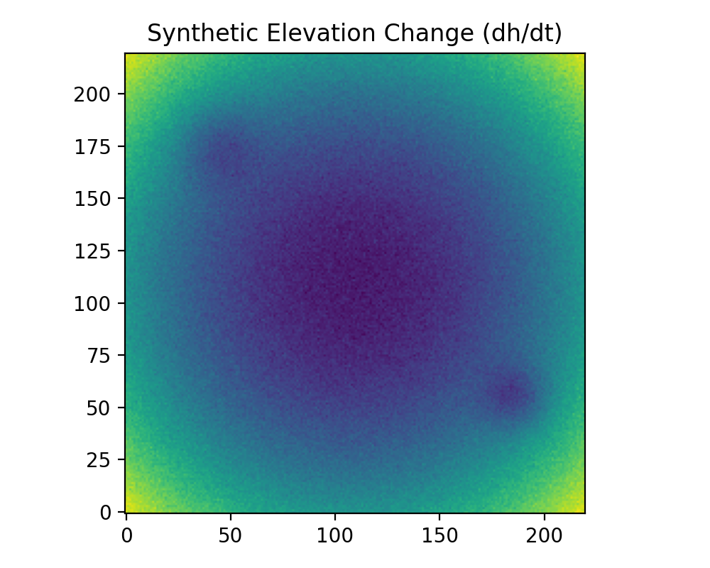
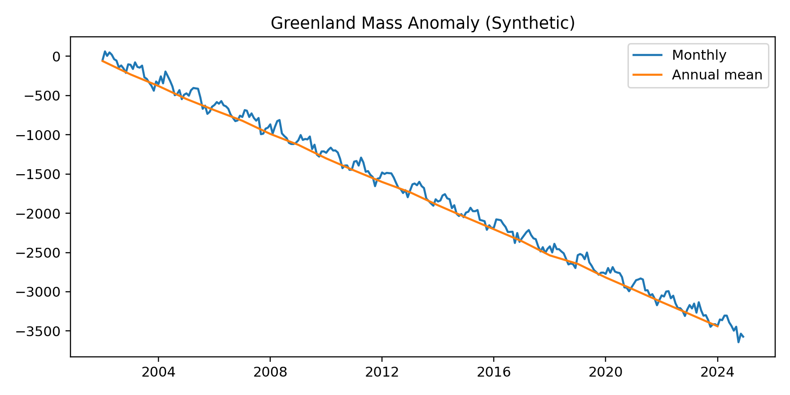

# Greenland Ice Sheet – GIS & Time‑Series Demo
Turning satellite data into maps & insights: Greenland mass balance (time-series) and elevation-change hotspots with Python, xarray & Geo tools.


Turning satellite data into maps & insights: Greenland mass balance (time-series) with trend & 95% CI, plus elevation-change hotspots (if ICESat data provided).




Quickstart:

```bash
python -m venv .venv
source .venv/bin/activate    # Windows: .venv\Scripts\activate
pip install -r requirements.txt
python src/pipeline.py
```
